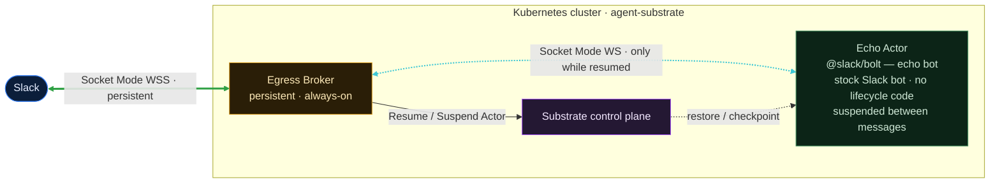

# WS-PoC — a Slack egress broker for suspendable agents

WS-PoC is a proof of concept for running an **always-on Slack agent on
agent-substrate while it is suspended almost all of the time**. A normal Slack
bot holds a long-lived WebSocket (Socket Mode) and idles waiting for messages.
On substrate, suspending an actor is a process checkpoint that frees the worker
and **destroys every socket the actor holds** — so an actor can never keep a
Slack WebSocket alive across a suspend.

WS-PoC solves this by **inverting socket ownership**. An always-on *egress
broker* owns the persistent connection to Slack. The actor still believes it
dials `slack.com` directly; its traffic is transparently redirected to the
broker, which terminates TLS with a certificate the actor trusts and holds the
real Slack socket itself. While the actor is suspended the broker keeps the
Slack connection open and filters keepalive frames. When a real message
arrives, the broker resumes the actor, the actor reconnects, and the broker
delivers the buffered message. The actor replies `echo: <message>`, and once it
goes idle the broker suspends it again.

> **Built on:** the [`ws-poc` branch of the substrate fork](https://github.com/ronlv10/substrate/tree/ws-poc).
> That branch carries the two small, additive atelet changes this PoC depends on
> (see [The substrate changes](#the-substrate-changes-in-the-fork)); everything
> else uses stock substrate.

## Architecture



The **broker** holds the persistent Slack Socket Mode connection and drives the
actor's lifecycle; the **actor** is a stock Slack bot that substrate checkpoints
(suspends) and restores (resumes) on demand. Two live connections, bridged by the
broker:

- **Broker ↔ Slack** — a real Socket Mode WebSocket over real TLS, kept open
  across the actor's suspend/resume cycles. Opened with the app-level token the
  broker captured from the actor's own `apps.connections.open` (the broker holds
  **no** pre-shared Slack secrets).
- **Actor ↔ Broker** — a stock Socket Mode client whose `slack.com` traffic is
  redirected to the broker. Ephemeral: it dies on suspend and the actor
  re-establishes it on resume.

State is keyed **per actor** (`atespace/name`), so each Slack connection maps to
exactly one actor and inbound events route unambiguously. The actor announces its
identity in an `X-Ate-Actor` header, read fresh from its per-resume `/run/ate`
mount — deterministic, with no source-IP race after a resume.

> **Note — identity header is a choice, not a hard dependency.** For now the actor
> sends the `X-Ate-Actor` header (one small broker-aware shim in an otherwise stock
> bot). It isn't fundamental: the broker could instead recover identity from the
> connection's source IP (correlated to `Actor.AteomPodIp`, flakier right after a
> resume), or a co-resident sidecar proxy could inject the header so the agent stays
> 100% stock. We chose the header for determinism in this PoC.

### Message lifecycle

1. First run: the actor connects, the broker captures the app token and opens
   the persistent Slack connection; the actor goes idle and the broker suspends it.
2. A user posts in Slack → the broker's Slack connection receives an
   `events_api` envelope.
3. The broker acks Slack immediately (within the ~3s window, so Slack does not
   redeliver), buffers the event, and calls `ResumeActor`.
4. `ResumeActor` returns once the actor is live; the actor's Socket Mode client
   reconnects (its old socket died on restore).
5. The broker attaches the reconnected actor, sends `hello`, and drains the
   buffered event(s).
6. The actor replies `echo: <text>` via `chat.postMessage` (forwarded through the
   broker to real Slack). After an idle grace period, the broker suspends it again
   from the outside.

Slack `hello` / `disconnect` frames and WebSocket ping/pong are **never**
delivered and never wake the actor.

## Transparent redirect and CA trust (PoC mechanisms)

- **Redirect — per-actor `/etc/hosts`.** The actor's `entrypoint.sh` resolves the
  broker Service (`BROKER_SERVICE`, a stable ClusterIP) and appends
  `<ip> slack.com wss-primary.slack.com` to its own `/etc/hosts` before starting
  Bolt. `slack.com` stays the TLS SNI, so the broker's cert still matches. The
  redirect lives only in the actor, so the broker is never caught by it and cluster
  DNS is untouched — no upstream-resolver workaround, no blast radius.
- **Cert trust — node bundle mounted into actors.** `certs/gen-ca.sh` produces the
  broker's self-signed certificate (with `slack.com` / `wss-primary.slack.com`
  SANs) once, at deploy. The `ca-installer` DaemonSet publishes `system CAs +
  broker cert` to the shared ateom hostPath on every node, and atelet is pointed
  at it via the `ATE_ACTOR_CA_BUNDLE` env var; atelet then bind-mounts it into
  every actor sandbox over `/etc/ssl/certs/ca-certificates.crt`.

### The substrate changes (in the fork)

The substrate-side changes live on the **`ws-poc` branch of the substrate fork**:
<https://github.com/ronlv10/substrate/tree/ws-poc>. Both are additive and opt-in
(`cmd/atelet/oci.go`, `cmd/atelet/main.go`):

- with `ATE_ACTOR_CA_BUNDLE=<path>`, atelet bind-mounts that CA bundle read-only
  over the actor's system CA store (inert when unset), so actors trust the broker cert;
- atelet writes the actor's atespace into the per-resume identity mount
  (`/run/ate/atespace`), which the actor sends to the broker as the `X-Ate-Actor` header.

Everything else uses the existing Control API. Build the cluster from that fork
branch so the atelet image includes these changes.

## Prerequisites

- A running substrate cluster built from the [`ws-poc` fork branch](https://github.com/ronlv10/substrate/tree/ws-poc) (kind
  quickstart: `hack/create-kind-cluster.sh && hack/install-ate-kind.sh
  --deploy-ate-system`). Note the snapshot bucket (`BUCKET_NAME`) and build the
  `ateom-gvisor` image (`ko build github.com/agent-substrate/substrate/cmd/ateom-gvisor`)
  — pass its digest as `ATEOM_IMAGE`.
- A Slack app with **Socket Mode enabled**. Collect:
  - an **app-level token** (`xapp-…`) with `connections:write`,
  - a **bot token** (`xoxb-…`) with `chat:write`,
  - event subscriptions for `message.channels` (and/or `app_mention`),
  - the bot invited to a test channel.
  The tokens live only in the actor's `slack-tokens` secret; the broker learns
  them from traffic.
- `ko`, `kubectl`, `kubectl-ate`, `jq`, `openssl`.

## Deploy (kind)

```bash
# From the repo root.

# 1. Broker CA + secret, broker + CA installer, atelet wiring.
make gen-ca
make deploy                 # ca-secret + deploy-broker + atelet-ca

# 2. Slack tokens (stored in the actor's namespace only).
make slack-secret APP_TOKEN=xapp-... BOT_TOKEN=xoxb-...

# 3. The echo actor template + worker pool. ATEOM_IMAGE is the substrate
#    ateom-gvisor image built from the fork.
make deploy-actor BUCKET_NAME=<your-bucket> ATEOM_IMAGE=<ateom-gvisor-digest>

# 4. Create the actor. Its first run bootstraps the broker's Slack connection.
make create-actor
```

## Demo

1. Confirm the actor bootstrapped and then suspended:
   ```bash
   kubectl logs -n ws-poc deploy/egress-broker | grep "persistent Slack connection established"
   kubectl ate get actors -a demo        # echo-1 → SUSPENDED
   ```
2. Post `hello world` in the test channel. Watch it wake, reply, and re-suspend:
   ```bash
   kubectl logs -n ws-poc deploy/egress-broker -f
   #   ... real Slack event received; delivering to actor
   #   ... resuming suspended actor to deliver event
   #   ... actor Socket Mode WebSocket attached
   kubectl ate get actors -a demo        # RESUMING → RUNNING → SUSPENDED
   ```
   Slack shows `echo: hello world`. The broker's Slack connection never dropped.
3. **Keepalive check:** leave it idle. Slack ping/`disconnect` frames appear in
   the broker log as ignored connection-management traffic, and `echo-1` stays
   `SUSPENDED` — keepalive does not wake the actor.

## Tests

```bash
make test        # go test ./...
```

Unit tests cover Socket Mode envelope classification (keepalive vs. real event),
the event buffer + immediate Slack-ack, keepalive filtering, resume
orchestration, and per-actor session keying — using fakes, no cluster required.

## Production hardening (documented, not built)

- **Per-workload transparent capture.** The `/etc/hosts` redirect only catches
  hostname egress; production would use in-pod `nftables` TPROXY/DNAT egress
  capture in `cmd/ateom-gvisor/main.go` (`installActorNftablesRules`) and
  `cmd/ateom-microvm/net.go`, scoped to opted-in actors. That also catches
  IP-literal egress.
- **Centrally managed CA**, gated per ActorTemplate rather than cluster-wide.
- **Multi-tenant Socket Mode.** The broker forwards HTTPS for any actor but only
  brokers Socket Mode for identified WS-PoC actors; full per-app Socket Mode
  multiplexing (so unrelated Slack apps coexist) is the next extension.
- **Durable buffer / HA.** The event buffer and captured tokens are in-memory; a
  broker restart loses them until an actor reconnects. Production would persist
  them and run the broker HA.
