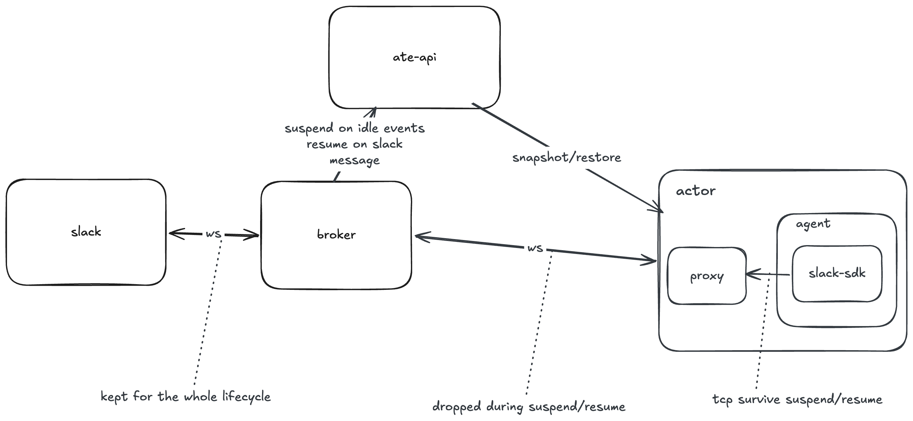

# WS-PoC — a Slack agent that stays online while suspended

A Slack bot holds a long-lived Socket Mode WebSocket. Suspending an actor on
agent-substrate checkpoints the process and **destroys every socket it holds**,
so a stock bot can't stay connected across a suspend.

The fix: a **local egress proxy baked into the actor image**. The agent talks
Socket Mode to the proxy over **loopback** — both ends inside the sandbox, so
`runsc` checkpoint/restore preserves it and the agent never sees a dead socket.
The proxy speaks resumable gRPC to an always-on **egress broker** that owns the
real Slack connection. On suspend only the proxy↔broker leg drops.

The proxy is agent-agnostic. Two actors ship on it:

- **`echo-actor`** — a stock `@slack/bolt` bot. Isolates the transport.
- **`openclaw-actor`** — OpenClaw, a stateful agent, run unmodified.

## Architecture



- **Broker ↔ Slack** — real Socket Mode WSS, held across suspend. Opened with the
  app token the broker captured from the agent's `apps.connections.open`; the
  broker holds no pre-shared Slack secrets.
- **Agent ↔ Proxy** — stock Socket Mode over loopback TLS. Survives the checkpoint.
- **Proxy ↔ Broker** — gRPC (`proto/brokerproxy`). The only leg that drops on
  suspend; the proxy re-announces on resume and replays from its last ack.

After each restore the agent re-dials its Socket Mode connection once (pong
staleness reads the jumped wall clock), but it's a loopback hop and the proxy
holds every event until the agent heartbeats, so nothing is lost.

## Running a stateful agent

A stock agent that takes seconds to start and to answer forces two timing rules
the broker and proxy enforce — invisible with the instant echo bot:

- **Don't checkpoint mid-startup.** A V8 runtime frozen during init `SIGILL`s on
  restore. The broker arms idle-suspend when the proxy announces, so the proxy
  defers its announce until the agent is quiescent — `Core.WaitQuiescent`.
- **Don't suspend mid-turn.** Socket Mode acks on receipt, but the agent thinks
  for ~10–20 s before replying. The broker holds suspend from ack until the reply
  or a bounded grace (`--handling-grace`, 90 s).

OpenClaw-specific setup, in `deploy/openclaw-actor.yaml.tmpl` and the baked
`openclaw.json`:

- Point `HOME` and every writable path at the `/data` durableDir — OpenClaw
  writes constantly, and a dirtied overlay rootfs trips `runsc restore`'s
  filestore check.
- Set the model provider in the config (OpenClaw reads no `ANTHROPIC_*` env),
  referencing the key via `{source: env, id: ANTHROPIC_API_KEY}` so the secret
  stays out of the image.
- Disable per-turn features a responder doesn't need (memory search, startup
  context, commitment inference, browser) — they otherwise dominate setup time.

A suspended→answered cycle is dominated by the resume path, then the model call.

## Layout

| Path | What it is |
|------|------------|
| `cmd/egress-broker/`, `internal/broker/` | Broker: gRPC server, per-actor session, event buffer, resume/suspend, handling hold. |
| `internal/slack/` | Slack wire types + the persistent real-Slack connection (slack-go). |
| `cmd/local-proxy/`, `internal/proxy/` | In-actor proxy: loopback Slack impersonation, hold-until-heartbeat, announce-when-quiescent, PID-1 supervisor. |
| `proto/brokerproxy/` | The broker↔proxy gRPC protocol. |
| `echo-actor/`, `openclaw-actor/` | The two actor images. |
| `deploy/`, `certs/` | Broker manifests, actor templates, proxy cert generation. |
| `spikes/` | Phase-0 experiments (loopback survival, Bolt churn). |

Standalone Go module; depends on public substrate only for the generated
`ateapipb` gRPC client.

## Redirect and trust — per image, no cluster-wide blast radius

- **Redirect.** The image's `/etc/hosts` points `slack.com` at `127.0.0.1`.
  atelet mounts nothing over it — no CoreDNS rewrite.
- **Trust.** The image bakes a CA + `slack.com` leaf (`certs/gen-proxy-cert.sh`);
  the agent trusts it via `NODE_EXTRA_CA_CERTS`. No node-level CA install.
- **Identity.** The proxy reads `atespace/name` fresh from the per-resume
  `/run/ate` mount on every announce (never cached). Needs the substrate fork's
  [`ws-poc` branch](https://github.com/ronlv10/substrate/tree/ws-poc) — the only
  substrate-side change v2 requires.

## Deploy (kind)

```bash
make deploy-broker
make slack-secret APP_TOKEN=xapp-... BOT_TOKEN=xoxb-...

# echo actor
make deploy-actor  BUCKET_NAME=<bucket> ATEOM_IMAGE=<digest> \
     BROKER_ADDRESS=egress-broker.ws-poc.svc.cluster.local:9090
make create-actor

# openclaw actor (also needs a model-endpoint key)
make anthropic-secret API_KEY=<inference key>
make deploy-openclaw BUCKET_NAME=<bucket> ATEOM_IMAGE=<digest> \
     BROKER_ADDRESS=egress-broker.ws-poc.svc.cluster.local:9090
make create-openclaw
```

Needs a Socket Mode Slack app: app token (`xapp-…`, `connections:write`), bot
token (`xoxb-…`, `chat:write`), `message.im` + `app_mention` subscriptions. One
app serves one actor (shared tokens split events — see backlog). Omit
`BROKER_ADDRESS` to run the proxy standalone (stubs + synthetic events, no broker).

## Tests

```bash
make test
```

Unit tests cover the broker session, the gRPC session (bufconn), and the proxy —
all with fakes, no cluster.

## Backlog

- **Multi-tenant Socket Mode** — per-app session keying so actors can share an app.
- **Durable buffer / HA** — buffer and captured tokens are in-memory; a broker
  restart loses them (and resets the event sequence).
- **Transport auth** — gRPC is plaintext; identity of record is the `Announce`.
  Production would add mTLS or a per-actor token.
